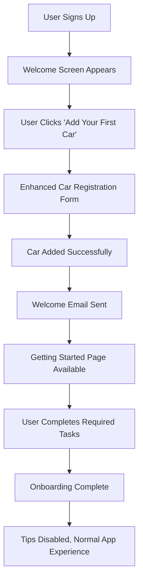
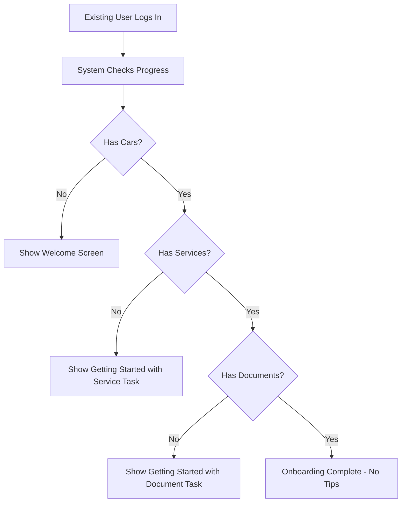
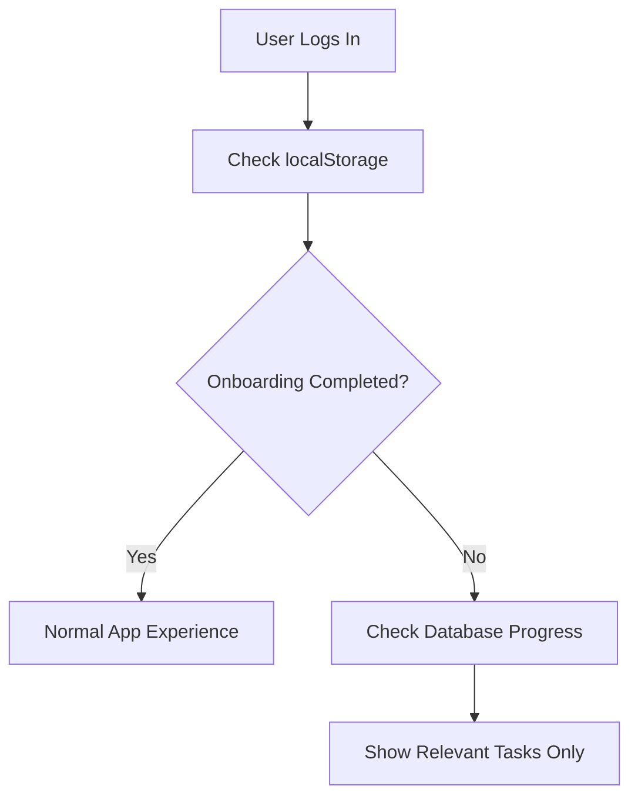

# 🚀 Carvetka User Onboarding Flows Documentation

## Overview

This document outlines the comprehensive user onboarding system implemented for Carvetka, including both the initial welcome experience and the dedicated Getting Started page. The system is designed to guide users through essential setup steps while respecting existing users and providing a clear, task-oriented experience.

## 🏗️ System Architecture

### **Multi-Layer Onboarding System**

```
Frontend UI Onboarding
├── Welcome Screen (First-time users)
├── Getting Started Page (Task-based)
├── Contextual Tips (Just-in-time help)
└── Progress Tracking (Real-time updates)

Backend Automation
├── Supabase Edge Functions
├── Database Triggers
├── Email Sequences
└── Engagement Tracking

State Management
├── OnboardingContext (React Context)
├── Local Storage (Persistence)
└── Real-time Database Queries
```

## 🎯 User Journey Flows

### **Flow 1: New User (No Data)**



### **Flow 2: Existing User (Has Some Data)**



### **Flow 3: Returning User (Completed Onboarding)**



## 📱 Component Structure

### **1. Welcome Screen (`/src/components/onboarding/welcome-screen.tsx`)**

**Purpose**: First impression for new users without cars

**Features**:
- Modal overlay with backdrop blur
- Two primary actions: "Add Your First Car" or "Browse Features"
- Feature highlights with icons
- Skip option for users who want to explore first
- Only shows for authenticated users without cars

**Logic**:
```typescript
// Only shows if:
- User is authenticated
- User has no cars
- showWelcomeScreen is true
```

### **2. Getting Started Page (`/src/app/(dashboard)/getting-started/page.tsx`)**

**Purpose**: Task-based onboarding experience

**Features**:
- Progress bar showing completion percentage
- Task cards with completion status
- Required vs optional task distinction
- Direct action buttons for each task
- Real-time progress updates
- Completion celebration

**Task Structure**:
```typescript
interface OnboardingTask {
  id: string
  title: string
  description: string
  icon: React.ReactNode
  href: string
  completed: boolean
  required: boolean
}
```

**Tasks**:
- **Required**: Add Car, Add Service, Upload Documents
- **Optional**: Fuel Tracking, Issue Reporting

### **3. Contextual Tips (`/src/components/onboarding/contextual-tips.tsx`)**

**Purpose**: Just-in-time guidance for specific actions

**Features**:
- Bottom-right positioning (non-intrusive)
- Conditional display based on user progress
- Dismissible with localStorage persistence
- Limited to 2 tips at a time
- "Dismiss All Tips" functionality

**Tip Conditions**:
```typescript
const TIPS = [
  {
    id: 'first-service',
    condition: (state) => state.hasAddedFirstCar && !state.hasAddedFirstService
  },
  {
    id: 'upload-documents',
    condition: (state) => state.hasAddedFirstCar && !state.hasUploadedFirstDocument
  }
  // ... more tips
]
```

### **4. Onboarding Context (`/src/contexts/onboarding-context.tsx`)**

**Purpose**: Centralized state management for onboarding

**State Interface**:
```typescript
interface OnboardingState {
  isOnboarding: boolean
  currentStep: number
  completedSteps: string[]
  hasAddedFirstCar: boolean
  hasAddedFirstService: boolean
  hasUploadedFirstDocument: boolean
  hasCompletedOnboarding: boolean
  showWelcomeScreen: boolean
  showContextualTips: boolean
  showGettingStarted: boolean
}
```

**Key Functions**:
- `checkOnboardingStatus()` - Queries database for user progress
- `completeStep(step)` - Marks a step as completed
- `completeOnboarding()` - Marks entire onboarding as complete
- `skipOnboarding()` - Allows users to skip onboarding

## 🔄 State Management Logic

### **Initial Load Sequence**

1. **Check localStorage** for `carvetka-onboarding-completed`
2. **If completed**: Set all onboarding flags to false
3. **If not completed**: Query database for user progress
4. **Determine state** based on what user has accomplished
5. **Set appropriate flags** for UI components

### **Progress Detection**

```typescript
const checkOnboardingStatus = async () => {
  // Query database for user's current progress
  const [cars, services, documents] = await Promise.all([
    supabase.from('cars').select('id').eq('user_id', user.id).limit(1),
    supabase.from('service_records').select('id').eq('user_id', user.id).limit(1),
    supabase.from('documents').select('id').eq('user_id', user.id).limit(1)
  ])

  const hasCars = cars.data && cars.data.length > 0
  const hasServices = services.data && services.data.length > 0
  const hasDocuments = documents.data && documents.data.length > 0

  // Set state based on progress
  if (!hasCars) {
    // Show welcome screen and getting started
  } else {
    // Show only incomplete tasks
  }
}
```

### **Real-time Updates**

- **Database triggers** automatically update progress
- **Auth state changes** trigger re-evaluation
- **Manual completion** updates state immediately
- **localStorage** persists user preferences

## 📧 Email Automation

### **Supabase Edge Function (`/supabase/functions/onboarding-workflow/`)**

**Purpose**: Automated email sequences based on user actions

**Triggers**:
- User adds first car → Welcome email
- User adds first service → Service confirmation
- User uploads first document → Document confirmation
- User inactive for 14 days → Re-engagement email

**Email Types**:
1. **Welcome Email** - Immediate, when first car added
2. **Service Reminder** - 3 days after car added (if no service)
3. **Document Reminder** - 1 week after car added (if no documents)
4. **Re-engagement** - 14 days of inactivity

### **Database Triggers**

```sql
-- Automatic triggers when users complete actions
CREATE TRIGGER trigger_cars_onboarding
  AFTER INSERT ON cars
  FOR EACH ROW
  EXECUTE FUNCTION trigger_first_car_workflow();

CREATE TRIGGER trigger_services_onboarding
  AFTER INSERT ON service_records
  FOR EACH ROW
  EXECUTE FUNCTION trigger_first_service_workflow();
```

## 🎨 UI/UX Patterns

### **Visual Hierarchy**

1. **Welcome Screen**: Modal overlay, high contrast, clear CTAs
2. **Getting Started**: Card-based layout, progress indicators
3. **Contextual Tips**: Subtle, dismissible, action-oriented
4. **Progress Tracking**: Visual progress bars, completion badges

### **Responsive Design**

- **Mobile**: Stacked layout, full-width buttons
- **Tablet**: Two-column grid for tasks
- **Desktop**: Three-column layout with sidebar

### **Accessibility**

- **Keyboard Navigation**: All interactive elements accessible
- **Screen Readers**: Proper ARIA labels and descriptions
- **Color Contrast**: WCAG compliant color schemes
- **Focus Management**: Clear focus indicators

## 🔧 Configuration & Customization

### **Environment Variables**

```bash
# Supabase Configuration
NEXT_PUBLIC_SUPABASE_URL=your_supabase_url
NEXT_PUBLIC_SUPABASE_PUBLISHABLE_KEY=your_publishable_key

# Email Service (Resend)
RESEND_API_KEY=your_resend_key
RESEND_FROM_EMAIL=noreply@carvetka.com
```

### **Customization Options**

**Onboarding Steps**:
```typescript
const ONBOARDING_STEPS = [
  'welcome',
  'add_car',
  'add_service', 
  'upload_document',
  'complete'
] as const
```

**Task Configuration**:
```typescript
const onboardingTasks = [
  {
    id: 'add_car',
    title: 'Add Your First Car',
    required: true,
    // ... other properties
  }
  // ... more tasks
]
```

**Email Timing**:
```typescript
const ONBOARDING_SCHEDULE = {
  welcome: 0, // minutes
  first_car_reminder: 60 * 24, // 1 day
  first_service_reminder: 60 * 24 * 3, // 3 days
  // ... more timing
}
```

## 📊 Analytics & Tracking

### **Key Metrics**

1. **Onboarding Completion Rate**
   - Users who complete all required tasks
   - Time to completion
   - Drop-off points

2. **Task Completion Rates**
   - Individual task completion percentages
   - Required vs optional task completion
   - Task completion order

3. **User Engagement**
   - Getting Started page visits
   - Task completion frequency
   - Email open/click rates

### **Tracking Implementation**

```typescript
// Track onboarding progress
const trackOnboardingStep = (step: string, data: any) => {
  analytics.track('onboarding_step_completed', {
    step,
    userId: data.userId,
    timestamp: new Date().toISOString(),
    ...data
  })
}
```

## 🚀 Deployment & Setup

### **1. Deploy Supabase Edge Function**

```bash
# Deploy the onboarding workflow
supabase functions deploy onboarding-workflow

# Set up environment variables
supabase secrets set RESEND_API_KEY=your_api_key
supabase secrets set RESEND_FROM_EMAIL=noreply@carvetka.com
```

### **2. Run Database Migrations**

```bash
# Apply database triggers
supabase db push
```

### **3. Frontend Integration**

```typescript
// Wrap your app with OnboardingProvider
<OnboardingProvider>
  {children}
  <WelcomeScreen />
  <ContextualTips />
</OnboardingProvider>
```

## 🔍 Testing & Validation

### **Test Scenarios**

1. **New User Flow**
   - Sign up → Welcome screen → Add car → Getting started → Complete tasks

2. **Existing User Flow**
   - Login with existing data → Check progress → Show relevant tasks

3. **Skip Onboarding**
   - User skips welcome screen → Normal app experience

4. **Email Triggers**
   - Add car → Check for welcome email
   - Add service → Check for confirmation

### **Validation Checklist**

- [ ] Welcome screen shows for new users only
- [ ] Getting Started page shows correct tasks
- [ ] Progress bar updates in real-time
- [ ] Email sequences trigger correctly
- [ ] Contextual tips show appropriately
- [ ] Dismiss functionality works
- [ ] Mobile responsiveness
- [ ] Accessibility compliance

## 🎯 Success Metrics

### **Primary KPIs**

- **Onboarding Completion Rate**: >70% of users complete required tasks
- **Time to First Value**: <24 hours from signup to first car
- **Task Completion Rate**: >80% for required tasks
- **User Retention**: >60% of users active after 7 days

### **Secondary KPIs**

- **Email Engagement**: >25% open rate, >5% click rate
- **Getting Started Usage**: >50% of users visit the page
- **Tip Effectiveness**: >30% of tips lead to action
- **User Satisfaction**: >4.5/5 onboarding experience rating

## 🔮 Future Enhancements

### **Planned Features**

1. **Personalized Onboarding Paths**
   - Different flows based on user type
   - Industry-specific guidance
   - Custom task recommendations

2. **Advanced Analytics**
   - Heat maps of user behavior
   - A/B testing for different flows
   - Predictive completion modeling

3. **Gamification**
   - Achievement badges
   - Progress streaks
   - Completion rewards

4. **Multi-language Support**
   - Localized onboarding content
   - Regional email templates
   - Cultural adaptation

## 📝 Maintenance & Updates

### **Regular Tasks**

1. **Monitor completion rates** and identify bottlenecks
2. **A/B test** different onboarding flows
3. **Update email templates** based on performance
4. **Review and update** task requirements
5. **Analyze user feedback** and iterate

### **Troubleshooting**

**Common Issues**:
- Tips showing for completed users → Check localStorage and database state
- Emails not sending → Verify Resend API key and Edge Function logs
- Progress not updating → Check database triggers and context state
- Mobile layout issues → Test responsive breakpoints

This comprehensive onboarding system provides a clear, task-oriented experience that guides users to success while respecting their existing progress and preferences.
